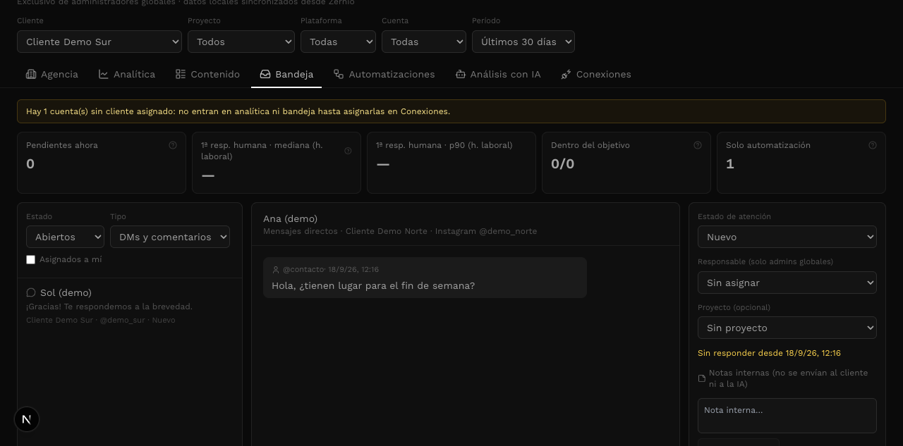
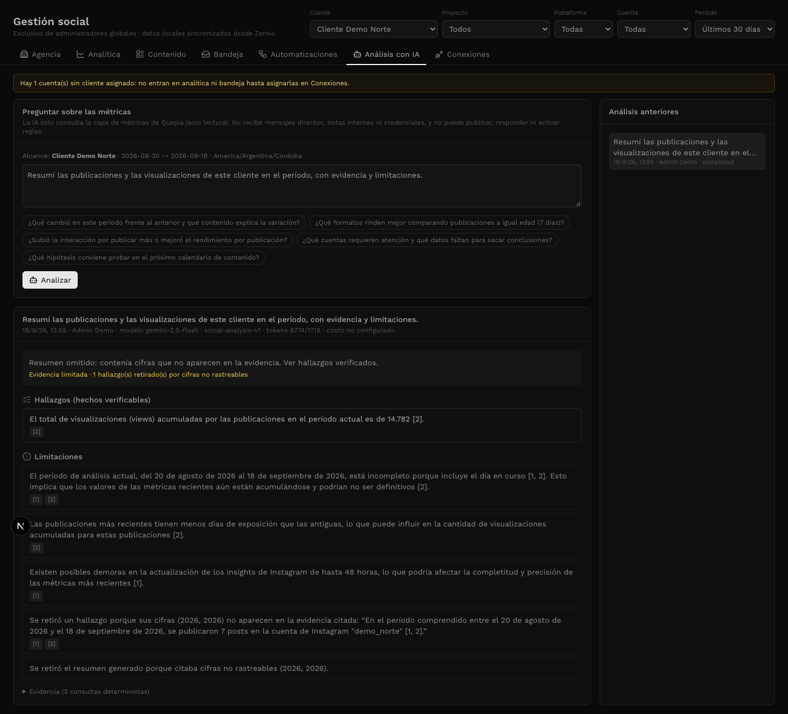

# Verificación de Gestión social / Zernio

Fecha: 18/09/2026. Resultado: **no aprobado para uso en producción todavía**.

La base técnica pasa las suites ejecutadas, pero se confirmaron cuatro fallas funcionales en la interfaz/IA, un problema de legibilidad y un bloqueo de instalación en la base real. Esta auditoría no modifica la implementación ni aplica migraciones.

## Alcance y método

Se revisó el módulo nuevo `components/sistema/social`, sus rutas administrativas, integración en el sistema, pruebas SQL, worker y MCP. Se recorrieron las siete pestañas en un navegador real sobre `/sistema/social`, usando Next local, PGlite con las migraciones reales y un proveedor Zernio simulado. Se verificaron pantallas a 1280/1440 px y a 390 px.

Las escrituras de prueba (crear cliente, respuesta DM y webhooks) quedaron exclusivamente en el entorno sintético. La prueba de análisis utilizó Vertex real con métricas sintéticas. La base Supabase vinculada se consultó solo en lectura. No se enviaron mensajes a personas, no se activaron reglas reales ni se desplegó.

## Hallazgos confirmados

### 1. Bloqueo operativo: faltan las migraciones del módulo en la base vinculada

Consulta real a Supabase: `to_regclass('public.sistema_social_jobs')`, `to_regclass('public.sistema_social_threads')` y `to_regprocedure('public.social_query(uuid,text,jsonb)')` devolvieron `null`. El historial remoto no contiene las seis migraciones sociales del 18/09.

Consecuencia: que el módulo funcione con el stack local no demuestra que funcione contra la base real. Su instalación debe resolverse antes de habilitarlo. El documento de implementación ya registra una divergencia del historial de migraciones; esta auditoría no intentó repararla ni ejecutar cambios remotos.

Acción: reconciliar el historial y validar las seis migraciones en staging; luego completar configuración del worker, secretos y webhooks, y probar el circuito real con una cuenta de prueba.

### 2. P1 — La bandeja conserva una conversación de otro cliente al cambiar filtros

Ubicación: `components/sistema/social/tabs/inbox-tab.tsx:45`, selección local; render de `ThreadPanel` condicionado únicamente por esa selección.

Reproducción:

1. Abrir Bandeja y seleccionar Ana, de Cliente Demo Norte.
2. Cambiar el filtro global a Cliente Demo Sur.
3. La lista pasa a mostrar Sur, pero el panel de conversación y el editor conservan Norte.
4. Escribir y enviar una respuesta de prueba: el proveedor simulado recibe `accountId: za_norte` mientras el filtro global indica Sur.

Es un riesgo de responder desde la cuenta equivocada por contexto incoherente, no una evasión de permisos: el usuario de prueba es administrador global.

Acción: cerrar o revalidar la conversación y su borrador al cambiar cliente/cuenta/proyecto/plataforma; el editor no debe permitir enviar desde una selección ajena al alcance visible.



### 3. P2 — El período “Personalizado” no funciona

Ubicación: `components/sistema/social/social-module.tsx:90–94`.

Al elegir “Personalizado” desde “Últimos 30 días”, el selector vuelve a `30`, no cambia la URL y hay cero inputs de fecha en el DOM. El manejador termina inmediatamente cuando recibe `custom`, pero los campos solo se muestran cuando el período derivado de la URL ya es personalizado.

Acción: persistir explícitamente el modo personalizado y mostrar ambos campos al seleccionarlo; verificar además que editar un rango que coincida con 7/30/90 días no cierre el editor inesperadamente.

### 4. P2 — Crear/asignar clientes no actualiza los filtros globales

Ubicación: `components/sistema/social/tabs/connections-tab.tsx:38–44` y carga de scopes en `social-module.tsx:49`.

Se creó “Cliente Auditoría UI” desde Conexiones. Apareció “Cliente creado” y el cliente quedó disponible en los selectores de asignación, pero no en el filtro global Cliente. Cambiar a otra pestaña tampoco lo incorpora: solo se refresca el inventario de Conexiones, no los scopes del módulo.

Consecuencia: el usuario necesita recargar la página para trabajar con un cliente recién creado. La misma dependencia de scopes afecta cuentas y vínculos recién asignados.

Acción: invalidar/refrescar los scopes compartidos después de mutaciones de clientes, perfiles y vínculos.

### 5. P2 — La IA descarta resultados correctos por fechas escritas en español

Ubicación: `lib/social/analysis-guards.ts:43–48` y `unverifiedNumbers`.

Una ejecución real de Gemini terminó en 200 y guardó su evidencia, pero eliminó el hallazgo correcto de 7 publicaciones y el resumen por contener “20 de agosto de 2026” y “18 de septiembre de 2026”. La interfaz mostró que las cifras `(2026, 2026)` no aparecían en la evidencia, aunque el período era correcto.

Reproducción determinista independiente del modelo:

```js
unverifiedNumbers(
  'Entre el 20 de agosto de 2026 y el 18 de septiembre de 2026 se publicaron 7 posts',
  [{ from: '2026-08-20', to: '2026-09-18', posts: 7 }]
)
// Resultado actual: [2026, 2026]
```

El extractor omite fechas ISO, pero no fechas en lenguaje natural. Acción: verificar las fechas contra el período de la evidencia y separarlas de las métricas; agregar regresiones en español sin ignorar indiscriminadamente números que podrían ser valores reales.



### 6. P2 — Contraste demasiado bajo en etiquetas e información de contexto

Ubicación representativa: `components/sistema/social/social-ui.tsx:24` y etiquetas `text-white/35`, `/40`, `/45` del módulo.

El sistema redefine el blanco a RGB 184/184/184. En navegador, descripciones con `text-white/40` resultan `rgba(184,184,184,0.4)`. Sobre `#0a0a0a`, el contraste calculado es aproximadamente 2,44:1; con `/35`, 2,13:1. Los textos pequeños de filtros, fechas, cuentas, advertencias contextuales y tablas resultan difíciles de leer.

La distribución móvil se adapta sin desbordamiento global en las pantallas verificadas a 390 px, pero la tabla de formatos queda muy comprimida y los textos débiles empeoran su lectura.

Acción: definir colores de texto secundarios con contraste suficiente para la paleta real del sistema y ofrecer una tabla con desplazamiento propio o tarjetas en móvil. Evitar arreglarlo modificando el blanco global de otras pantallas.

[Captura de Analítica móvil](2026-09-18-zernio-evidencia/zernio-analytics-mobile-full.png) · [Captura de Contenido móvil](2026-09-18-zernio-evidencia/zernio-content-mobile.png)

## Verificación completada

| Comprobación | Resultado |
|---|---|
| Suites sociales: SQL, worker, normalización, políticas, firmas y análisis | 85/85 pasan |
| Suite MCP, incluidas pruebas sociales | 85/85 pasan |
| HTTP local: admins, no admins, OAuth, origen, parámetros, webhooks e idempotencia | 32/32 pasan |
| TypeScript | Sin errores |
| Build de producción (`next build`) | Completado correctamente; advertencias existentes en otras áreas |
| ESLint limitado a componentes, bibliotecas y rutas del módulo | Sin errores ni advertencias |
| Verificador de límites MCP | Pasa |
| Navegador | Las siete pestañas cargan; fallas de interacción descritas arriba |
| Envío DM local | Un envío al proveedor simulado, mostrado como `sent`; se confirmó también el fallo de contexto |
| Simulación de automatización | 3/3 ejemplos coinciden, sin activar la regla |
| IA real sobre datos sintéticos | Ejecución guardada, evidencia visible y 14.782 views correctas; falso positivo en fechas |
| Base real | Tablas/RPC nuevas ausentes; instalación pendiente |

## Límites de esta auditoría

- No se verificó la experiencia dentro del dashboard completo con datos reales: la prueba interactiva usó la ruta directa del mismo componente. La integración del menú se revisó en código.
- No se certifican envíos, automatizaciones, sincronización histórica ni webhooks de Zernio real. No se activó ninguna automatización externa.
- El stack de prueba no implementa la tabla global `configuracion`, lo que genera un aviso de desarrollo ajeno al módulo. Tampoco implementa `GET /inbox/conversations`: el proceso HTTP registra una falla de backfill por “No simulado”. El “TODO OK” del script HTTP no acredita ese trabajo; sí acredita sus 32 aserciones de acceso/contrato/webhooks.
- Las pruebas de SQL usan PGlite y no reemplazan la validación final de permisos, funciones y migraciones en Supabase staging.
- Los logs de pruebas y capturas se conservaron en `2026-09-18-zernio-evidencia/`.

## Orden recomendado

Corregir primero el contexto de la bandeja; después fechas personalizadas, refresco de scopes, guardas de IA y contraste. Resolver la instalación en staging, repetir los casos de regresión y recién entonces validar el circuito real antes de habilitar producción.
