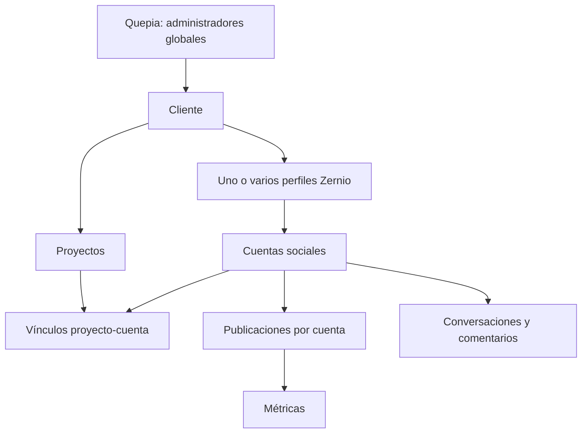
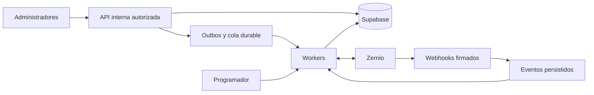

# Quepia: módulo administrativo de gestión social con Zernio

Fecha del diagnóstico: 18 de septiembre de 2026.

Estado: especificación de arquitectura y plan de implementación. La investigación original no modificó código, migraciones ni configuraciones. Este documento no acredita que las funcionalidades propuestas estén implementadas.

## 1. Objetivo y restricciones obligatorias

Agregar a Quepia analítica, gestión de interacciones y automatizaciones para una agencia con múltiples clientes, proyectos y cuentas sociales.

**Objetivo final ampliado por el usuario:** permitir tanto la interpretación humana como el acceso de IA a las métricas para analizarlas, comparar resultados y obtener conclusiones mejor fundamentadas. La inteligencia analítica es parte del producto final, no un agregado opcional. El acceso de IA conserva exactamente la restricción de administradores globales y el aislamiento entre clientes.

**TODO EL MÓDULO ES EXCLUSIVO DE ADMINISTRADORES GLOBALES DE QUEPIA**, tanto para lectura como para escritura. Un administrador de proyecto, integrante de la agencia o cliente no adquiere acceso por pertenecer a un proyecto.

La condición de acceso debe comprobar en servidor:

```text
sesión autenticada
AND sistema_users.role = 'admin'
AND sistema_users.is_authorized = true
AND sistema_users.is_active = true
AND sistema_users.deleted_at IS NULL
```

No reconstruir publicación, programación, calendario editorial, preparación de archivos ni editor de contenido: ya existen. Reutilizar sus registros, cuentas y servicios, realizando solamente los ajustes de compatibilidad necesarios.

La vista global de agencia y las vistas por cliente, proyecto, plataforma y cuenta deben compartir un modelo consistente. Nunca mezclar información entre clientes por una relación inferida o un identificador recibido del navegador.

### Clasificación de evidencia

- **Verificado:** observado en repositorio, Supabase o consultas GET realizadas durante el diagnóstico.
- **Documentado:** respaldado por documentación oficial consultada, sin garantizar que esté habilitado en cada cuenta.
- **Por validar:** requiere prueba técnica o aclaración del proveedor.
- **Propuesto:** decisión de arquitectura de Quepia.

Los hallazgos y precios son una fotografía de la fecha indicada. Revalidar documentación, esquema y entorno antes de implementar. No convertir propuestas en supuestas capacidades del proveedor.

## 2. Diagnóstico del repositorio y Supabase

### Arquitectura existente

- Next.js 15, React 19, TypeScript y Supabase.
- `/sistema` utiliza vistas internas y componentes cargados dinámicamente.
- Navegación: `app/sistema/dashboard-client.tsx` y `components/sistema/quepia/app-sidebar.tsx`.
- Cliente Zernio: `lib/zernio/client.ts`, base `https://zernio.com/api/v1`, autenticación Bearer desde servidor.
- Servicios y permisos: `lib/zernio/server.ts`.
- Autorización general: `lib/sistema/auth/authorization.ts`.
- API de publicación: `app/api/zernio/`.
- Interfaz existente: `zernio-publishing-panel.tsx`, `zernio-project-control.tsx`, `zernio-media-preparer.tsx`.
- Migraciones: `20260817222854_zernio_phase_one.sql` y `20260817223033_zernio_phase_one_hardening.sql`.
- `vercel.json` contiene procesos periódicos de otros módulos, pero no se encontró sincronización periódica ni receptor de webhooks de Zernio.

### Datos observados

Supabase vinculado al repositorio: proyecto `quepia-pagina`, referencia `luhbezpflvmevorbayai`.

| Entidad | Situación verificada |
|---|---|
| `sistema_users` | Tiene `role`, `is_authorized`, `is_active` y `deleted_at`. |
| `sistema_projects` | Tiene `parent_id`, pero no `client_id`. |
| `public.clients` | Existe, estaba vacía. |
| `sistema_client_access` / `sistema_client_sessions` | Acceso al portal ligado a proyectos; no equivalen a una identidad comercial de cliente. |
| `sistema_zernio_profiles` | Un perfil por proyecto: `project_id NOT NULL UNIQUE`; ID externo único. |
| `sistema_zernio_accounts` | Cuenta ligada a perfil por `integration_id`; ID externo único; metadata JSON. |
| `sistema_zernio_publications` | Proyecto, tarea, ID Zernio, request UUID, estados, arreglos de cuentas/assets y resultados JSON. |

Conteos al investigar: 6 proyectos, 3 perfiles Zernio, 3 cuentas almacenadas y 9 registros de publicaciones. Estos últimos no equivalen necesariamente a nueve publicaciones exitosas.

Las tablas Zernio tienen RLS y acceso directo revocado para clientes del navegador; el servidor utiliza un cliente privilegiado.

### Funcionalidad que debe preservarse

- Creación de perfiles y conexión OAuth.
- Publicación inmediata, borradores y programación.
- Preparación y transferencia de archivos.
- Identificador local de solicitud.
- Historial y resultados por plataforma.
- Consulta de cuota Instagram.
- Edición, eliminación y reintentos.

### Hallazgos que condicionan el diseño

1. El vínculo perfil–proyecto es demasiado rígido para varias cuentas de la misma red y cuentas compartidas entre proyectos del mismo cliente.
2. `account_ids` y `platform_results` sirven al envío, pero falta una identidad normalizada de publicación por cuenta para analítica e interacciones.
3. Algunas lecturas actuales (`GET /api/zernio/project` y contexto de publicación) comprueban acceso al proyecto, no administrador global. No copiar ese permiso al nuevo módulo.
4. `getQuepiaSession()` no comprueba explícitamente `is_authorized`. Las protecciones generales no sustituyen una comprobación completa antes de consultar datos privilegiados.
5. `syncProjectAccounts()` desactiva cuentas antes del upsert. Una falla intermedia puede dejar un estado incorrecto. Reconciliar de manera atómica y no confundir respuestas parciales con eliminaciones.
6. El cliente HTTP no conserva headers de cuota, no establece timeout explícito ni política de reintentos por operación; necesita admitir `PATCH` para automatizaciones.
7. No extrapolar permisos a MCP: las capacidades existentes no deben recibir acceso social automáticamente.

### Consultas reales realizadas a Zernio

Con la credencial local, sin exponer secretos:

| Consulta | Resultado |
|---|---|
| `GET /usage` | 200, `billingSystem: metronome`, `planName: Usage-Based`, `hasAccess: true`, `usage.connectedAccounts: 0`. |
| `GET /accounts` | 200, dos cuentas activas de Instagram. |
| `GET /analytics?limit=1&page=1` | 200, un registro. |
| `GET /accounts/follower-stats` | 200, dos cuentas. |
| `GET /accounts/health` | 200, dos cuentas. |
| Headers de cuota | 60/minuto generales, 6/segundo analítica. |

**Pendiente:** reconciliar tres cuentas locales, dos cuentas listadas y cero en el contador de uso. No atribuir la diferencia a una causa sin comprobarla. No se confirmó que la credencial desplegada coincida con la local. Un 200 de salud no significa que todas las cuentas tengan todos los permisos.

## 3. Matriz de capacidades del proveedor

Endpoints relativos a `https://zernio.com/api/v1`.

| Capacidad | Contrato documentado | Uso en Quepia |
|---|---|---|
| Analítica por publicación | `GET /analytics`; filtros cuenta, perfil, plataforma, origen y fechas | Dashboard y ranking. Acceso básico verificado. |
| Evolución por publicación | `GET /analytics/post-timeline` | Curvas; verificar acumulados frente a valores diarios. |
| Agregados diarios | `GET /analytics/daily-metrics` | Diferenciar `attribution=publish` y `received`. |
| Seguidores | `GET /accounts/follower-stats` | Evolución diaria; acceso verificado. |
| Cuenta Instagram | `GET /analytics/instagram/account-insights` | Rendimiento total de cuenta, separado de posts. |
| Publicaciones externas | `POST /posts/sync-external` | Importar referencias de contenido publicado fuera de Quepia. |
| Cambios incrementales | `GET /analytics/delta`, evento `analytics.synced` | Sincronización eficiente. |
| Conversaciones | `GET /inbox/conversations` | Bandeja de DMs compatible. |
| Mensajes | `GET/POST /inbox/conversations/{conversationId}/messages` | Historia y respuestas. |
| Comentarios | `GET /inbox/comments`, `GET/POST /inbox/comments/{postId}` | Inventario y atención de hilos. |
| Respuesta privada | `POST /inbox/comments/{postId}/{commentId}/private-reply` | Instagram/Facebook con restricciones. |
| Automatizaciones | `GET/POST /comment-automations`, detalle y actualización por ID | Palabras clave, publicación o cuenta. |
| Stories | `trigger: story_reply` | Instagram. |
| Workflows | `/workflows`, activación, pausa, ejecuciones | Avanzado: condiciones, esperas y handoff. |
| Salud | `GET /accounts/health`, `/accounts/{accountId}/health` | Permisos y reconexión. |
| Atención de agencia | No se confirmó contrato equivalente a lo solicitado | Estados, asignación, notas, auditoría y SLA locales. |

### Restricciones por plataforma

| Plataforma | Analítica | Comentarios | DMs / automatización |
|---|---|---|---|
| Instagram | Posts e insights de cuenta; permisos específicos | Leer, responder y moderar; likes con acceso limitado | DMs, comentario→DM y respuestas a Stories; cuenta profesional |
| Facebook Pages | Posts y estadísticas de página | Comentarios y moderación | Messenger y comentario→DM |
| LinkedIn | Diferencias personal/organización | Organizaciones | Sin DMs en integración documentada |
| TikTok | Básicas y ampliadas según conexión | Business app | Cuenta Business, región y ventana condicionan soporte |
| YouTube | Videos/Shorts y endpoints especializados | Sí | Sin DMs |
| X | Métricas con cargos propios de API | Sí | Scopes y cargos específicos |
| Threads | Analítica y respuestas | Sí | Sin DMs |
| Pinterest | Analítica de Pines | Sin bandeja documentada | Sin DMs |
| Google Business Profile | Rendimiento de ubicación; no sustituye métricas por post | Reseñas | No asumir mensajería social equivalente |

Implementar capacidades por cuenta, tipo de conexión, permisos y plataforma; no habilitar únicamente por nombre de red.

Detalles documentados:

- Instagram requiere permisos diferentes para publicar, leer insights, comentarios y DMs; varían según Facebook Login o Instagram Login.
- Instagram/Facebook: respuesta privada a comentario, una por comentario dentro de siete días. No otorga permiso ilimitado para continuar mensajes.
- TikTok: DMs como respuesta, hasta diez mensajes dentro de 48 horas; restricciones para EEA, Suiza y Reino Unido. Métricas avanzadas pueden demorar 24–48 horas.
- LinkedIn: documentación general restringe métricas personales a posts Zernio; documentación de importación describe una excepción por URL. Probar antes de prometer históricos.
- TikTok: hay texto contradictorio sobre watch time en la página oficial. Probar por conexión.
- No usar `HUMAN_AGENT` para eludir restricciones de automatización; validar ventanas y uso permitido antes de habilitar envíos fuera de la ventana estándar.

## 4. Modelo multicliente



Invariantes:

- Un cliente tiene varios proyectos y perfiles Zernio.
- Una cuenta pertenece a un cliente; puede participar en varios proyectos de ese mismo cliente.
- Una publicación nativa por cuenta se almacena una vez.
- Los posts de Quepia heredan proyecto desde la tarea; los externos comienzan sin atribución a proyecto.
- Los DMs pertenecen a cliente/cuenta; proyecto opcional asignado explícitamente.
- Conservar histórico de vínculos. Cambiar una asociación no debe reclasificar automáticamente el pasado.
- Zernio documenta una cuenta por plataforma por perfil. Otra conexión puede reemplazar la anterior. Permitir múltiples perfiles por cliente.
- Reconexiones pueden cambiar IDs del proveedor: preservar identidad nativa e historial de conexiones.

El filtro por proyecto debe distinguir:

1. Contenido atribuido al proyecto.
2. Rendimiento completo de las cuentas vinculadas al proyecto.

No atribuir crecimiento total de seguidores a cada campaña que utiliza una cuenta.

## 5. Semántica y presentación de métricas

Crear un catálogo versionado con: nombre original, nombre normalizado, plataforma, tipo de cuenta, unidad, alcance (cuenta/post), período, agregado/acumulado, dimensiones, denominador, disponibilidad y fuente.

Reglas:

- No sumar alcance y presentarlo como personas únicas. Diferenciar suma de alcances y alcance único que informe el proveedor para un período.
- Seguidores de varias cuentas son seguidores acumulados, no audiencia deduplicada.
- Reproducciones no tienen necesariamente la misma definición entre redes.
- No mezclar insights de cuenta con suma de posts.
- Ausencia no equivale a cero. Estados: válido, pendiente, no soportado, sin permiso, error y cobertura incompleta.
- No sumar snapshots acumulados entre fechas.
- No promediar porcentajes de engagement sin ponderación y denominadores compatibles.
- Fórmulas visibles: engagement por alcance, impresiones o seguidores; tasa nativa separada.
- Una fórmula común puede usar likes + comentarios + compartidos + guardados solo si componentes y cobertura son comparables.
- Comparar contenido a igual edad (24h, 7d, 30d) cuando exista histórico suficiente.
- Mostrar tamaño de muestra, frescura, zona horaria y períodos incompletos.
- Diferenciar orgánico/pago cuando el proveedor lo exponga; no inferirlo sin evidencia.
- Ranking por formato, cuenta, plataforma y período, con valores nulos excluidos o explícitos.
- No calcular crecimiento porcentual cuando el denominador es cero; mostrar variación absoluta y porcentaje no disponible.

`daily-metrics`: `publish` atribuye acumulados a la fecha de publicación; `received` atribuye incrementos al día de recepción. Exponer un selector claro.

Instagram account-insights documenta máximo 90 días por consulta, demoras de hasta 48 horas y restricciones de series temporales. No prometer curva diaria nativa para cada métrica. Ventanas de consulta no garantizan antigüedad disponible.

## 6. Arquitectura



Las pantallas leen datos locales. No disparar fan-out al proveedor al abrir el dashboard.

- Next.js: interfaz, autorización, API y recepción de eventos.
- Cola durable: leases/bloqueos, intentos, próxima ejecución, recuperación tras caída y errores terminales.
- Procesamiento inicial por lotes acotados sobre infraestructura existente; worker dedicado si latencia/volumen lo requieren.
- Presupuesto compartido de solicitudes y concurrencia limitada, con justicia entre clientes.
- Prioridad: publicación existente y respuestas humanas, luego eventos, luego carga histórica.
- Credenciales exclusivamente de servidor.
- Adaptador Zernio separado de normalización, dominio de atención y dominio de métricas.
- No asumir soporte de una cola o programador concreto sin verificar infraestructura y plan.

## 7. Modelo de datos y migraciones propuestas

Los nombres son orientativos. Revalidar tablas existentes antes de crear entidades duplicadas.

| Tabla/cambio | Función y restricciones |
|---|---|
| `clients` | Reutilizar identidad comercial; revisar RLS/grants existentes. |
| `sistema_projects.client_id` | FK, asignación explícita y validada. |
| `sistema_zernio_profiles.client_id` | Propiedad comercial. |
| `sistema_social_project_accounts` | Proyecto/cuenta/vigencia, mismo cliente. |
| `sistema_social_project_profiles` | Varios perfiles por proyecto, un predeterminado. |
| Ampliar `sistema_zernio_accounts` | Identidad nativa, tipo de cuenta, capacidades y salud. |
| `sistema_social_account_connections` | Historial de IDs y conexiones del proveedor. |
| `sistema_social_posts` | Cuenta, ID nativo, ID externo Zernio, origen, formato, fecha, referencia opcional a publicación/tarea. |
| `sistema_social_post_projects` | Atribución explícita; un proyecto primario en MVP. |
| `sistema_social_metric_definitions` | Definiciones, unidades y semántica versionada. |
| `sistema_social_post_metric_snapshots` | Valores acumulados por post/métrica/observación. |
| `sistema_social_account_metrics` | Valores por cuenta/período/granularidad/dimensiones. |
| `sistema_social_threads` | Tipo DM/comentarios, cliente, cuenta, proyecto opcional, atención. |
| `sistema_social_interactions` | IDs externos, autor, dirección, relación padre, fechas, entrega y fuente humana/automática. |
| `sistema_social_assignments` | Historial de responsables. |
| `sistema_social_notes` | Notas internas independientes de mensajes externos. |
| `sistema_social_attention_events` | Apertura, respuesta, espera, resolución y reapertura. |
| `sistema_social_automations` | Motor local/Zernio, ID externo, configuración versionada, estado y autor. |
| `sistema_social_automation_runs` | Ejecución, deduplicación, resultado y error. |
| `sistema_social_webhook_events` | ID externo único, recepción, estado y errores. |
| `sistema_social_sync_state` | Cursor por flujo/credencial/alcance y última confirmación. |
| `sistema_social_sync_runs` | Duración, cobertura, páginas, conteos y fallas. |
| `sistema_social_outbox` | Acciones durables, idempotencia y resultados ambiguos. |
| `sistema_social_provider_payloads` | JSON original saneado, hash, versión, fuente y retención. |
| `sistema_social_audit_events` | Actor, cliente, entidad, acción y cambios. |

### Claves y aislamiento

- IDs externos como texto, sin asumir UUID ni entero.
- Unicidad de post por cuenta + ID nativo.
- Unicidad de interacción por cuenta + tipo + ID externo.
- Unicidad de evento por proveedor + entorno + ID.
- Unicidad de métricas según entidad + definición + período/observación + dimensiones.
- Índices por cliente/cuenta/fecha; atención por estado/responsable/actividad.
- FKs compuestas o validaciones transaccionales impiden relaciones cruzadas entre clientes.
- No borrar histórico social en cascada al borrar una tarea.
- Guardar `observed_at`, período del dato y timestamp del proveedor como conceptos distintos.
- Conservar JSON para trazabilidad y reprocesamiento, sin secretos ni retención ilimitada por defecto.

### Secuencia de migración

1. Clientes y asignación de proyectos.
2. Propiedad y vínculos multicuenta.
3. Publicaciones nativas y backfill del historial existente.
4. Métricas, sincronización y auditoría base.
5. Bandeja, asignación y SLA.
6. Automatizaciones y ejecuciones.

Incluir índices, grants, RLS y pruebas en la fase correspondiente, no al final del proyecto.

Preservar compatibilidad: cargar relaciones actuales como perfil predeterminado. No quitar la unicidad de `project_id` mientras `getProjectIntegration()` espere una sola fila. Diseñar transición expandir–migrar–adaptar; perfiles adicionales pueden necesitar que el antiguo vínculo sea opcional. Adaptar resolutores de cuentas sin reconstruir el publicador.

## 8. Sincronización y webhooks

### Bootstrap de analítica

1. Reconciliar inventario e identidad del cliente.
2. Tomar y persistir cursor inicial del delta.
3. Importar baseline paginada.
4. Consumir delta desde el cursor previo.
5. Actualizar filas y cursor transaccionalmente.

El delta documenta siete días de retención y rechazo de cursores de más de seis días. Tras expiración, repetir bootstrap. Valores absolutos se actualizan, no se suman como incrementos.

**Discrepancia oficial:** la guía del webhook menciona `sync.cursor`; el contrato de delta dice que el evento no lleva cursor. Mantener cursor propio, tratar webhook como señal y probar payload real. No fabricar ni interpretar cursores opacos. Páginas vacías inmediatamente después de un evento pueden requerir repetir el cursor; confirmar comportamiento antes de avanzar.

### Receptor

- Endpoints separados para analítica y operaciones/interacciones.
- Validación HMAC-SHA256 del cuerpo original, comparación constante.
- Persistencia durable y deduplicación antes de responder 2xx.
- Objetivo interno de ack inferior a dos segundos; proveedor exige menos de cinco.
- Worker aplica cambios; eventos fuera de orden no deben retroceder estados válidos.
- Cuenta desconocida: cuarentena, nunca asignar por nombre ni al primer cliente.
- No rechazar indiscriminadamente eventos antiguos: reintentos mantienen timestamp original.

Eventos de interés: `analytics.synced`, `account.connected`, `account.disconnected`, eventos de publicación existentes, `conversation.started`, `message.received`, `message.sent`, `comment.received` y los eventos de edición/borrado/entrega/lectura soportados por cada plataforma.

No todas las redes emiten todos los eventos. Por ejemplo, entrega y fallas tienen cobertura distinta de lectura. Mantener esa diferencia en la UI.

Zernio documenta hasta siete intentos, extendidos aproximadamente 51 horas, y desactivación de endpoints persistentemente fallidos. Observar logs, estado del endpoint y cola de fallas.

### Frecuencias iniciales propuestas

| Proceso | Frecuencia |
|---|---|
| Interacciones | Webhooks |
| Delta de respaldo | 10–15 minutos, agrupando señales |
| Seguidores | Diario |
| Salud | Horaria y ante errores |
| Reconciliación de bandeja | Periódica según cobertura y volumen |
| Corrección de datos recientes | Diaria |
| Históricos | Lotes de prioridad baja |

Frescura documentada: analítica cacheada aproximadamente una hora; seguidores diarios; externos aproximadamente 90 minutos; vistas diarias YouTube pueden retrasarse 2–3 días. Mostrar datos pendientes y antigüedad real.

Instagram/Facebook: repetir barrido de conversaciones tras onboarding, ya que el replay histórico puede completar después y no emite webhooks. No prometer histórico ilimitado.

### Reintentos y outbox

- GET: reintentos acotados con backoff y jitter.
- 429: respetar `Retry-After`, no bloquear innecesariamente otras plataformas por cuotas específicas.
- Mensajes/comentarios: UUID local por acción y `Idempotency-Key` donde esté documentado.
- Timeout/5xx al enviar: resultado por confirmar, reconciliar antes de repetir.
- La idempotencia del proveedor conserva éxitos; no garantiza que un error ambiguo no haya enviado.
- No reutilizar la lógica de `x-request-id` de creación de posts como contrato universal.
- Cursor y resultados se confirman juntos; leases deben permitir retomar un worker interrumpido.

### Credenciales y salud

Zernio administra renovación cuando la plataforma lo permite. Quepia detecta revocación/permisos y ofrece reconectar mediante el flujo existente, dentro del perfil correcto. No inventar endpoint genérico de refresh.

Validar identidad nativa después de reconectar. Rotar API key por separado, mantener secretos en servidor y observar alcance. Scoped keys sirven para aislamiento, no para multiplicar cuota.

## 9. Bandeja y atención

Tres columnas: hilos; conversación/comentarios; contexto de cliente/cuenta/proyecto/responsable/notas.

- Estados: nuevo, asignado, en atención, esperando respuesta, resuelto.
- Reabrir cuando llegue una interacción relevante posterior.
- `active/archived` de Zernio no sustituye estados de atención locales.
- Responsables operativos: exclusivamente admins globales válidos.
- Integrantes no admins pueden participar en tareas derivadas sin recibir acceso a bandeja, mensajes ni notas.
- Compositor siempre muestra cuenta remitente; nota interna y respuesta pública/privada son acciones diferentes.
- Evitar doble respuesta concurrente mediante control de versión, claim de atención o advertencia verificable.
- Adjuntos y acciones se limitan a capacidades de la cuenta.

SLA local: primera respuesta humana, primera automática por separado, resolución, pendientes sin responder, mediana/p90, horario laboral configurable y tiempo corrido.

La estadística de respuesta de Zernio excluye conversaciones sin respuesta. No usarla sola para representar cumplimiento de agencia. Identificar bots y respuestas desde fuera de Quepia para no atribuirlas a un admin sin evidencia.

## 10. Automatizaciones

Separar:

- Zernio ejecuta automatizaciones nativas de mensajes compatibles.
- Quepia ejecuta asignación, estados, recordatorios internos, SLA y auditoría.

Primeras plantillas: comentario con palabra clave→DM; respuesta a Story→DM; respuesta pública complementaria cuando corresponda.

Controles obligatorios:

- Cliente/cuenta explícitos; nunca regla global de envío por defecto.
- Vista previa y simulación sin efectos externos.
- Versionado y registro del admin activador.
- Validación de permisos y ventanas al ejecutar, no solo al crear.
- Detección de superposición entre reglas por post y por cuenta.
- Deduplicación por evento/regla/acción y protección ante ecos propios.
- Evitar dos motores ejecutando la misma respuesta.
- Presupuesto/volumen máximo y pausa por cuenta.
- Contabilizar enviados, fallidos, omitidos y pendientes, sin confundir aceptación con entrega.

Zernio documenta coincidencias exactas, por palabra o por contenido, exclusiones, `alsoMatchInDms` y una regla específica activa por publicación. Reglas generales múltiples pueden correr independientemente.

Respuesta pública exclusivamente automática: propuesta local usando eventos y endpoint de respuesta; no etiquetarla como función nativa del endpoint de comentario→DM, que requiere DM.

Workflows avanzados: condiciones, esperas y handoff. Pausa detiene nuevas ejecuciones, pero las ya iniciadas continúan. El interruptor debe explicar su alcance; no prometer cancelación inmediata de todo sin contrato confirmado.

No incluir respuestas de IA autónomas en el MVP.

## 11. Pantallas y componentes

Integrar en navegación administrativa existente:

| Vista | Contenido |
|---|---|
| Agencia | Filas por cliente/cuenta, salud, pendientes, frescura y comparaciones |
| Analítica | Series, métricas compatibles, períodos y cobertura |
| Contenido | Ranking, formato, origen, detalle y evolución |
| Bandeja | DMs/comentarios, estados, responsables y notas |
| Automatizaciones | Reglas, simulación, activación y ejecuciones |
| Conexiones | Permisos, reconexión, cuota, errores y sincronización |

Filtros persistidos en URL: cliente→proyecto→plataforma→cuenta→período; formato y origen cuando aplique. Validar combinaciones en servidor y reiniciar selecciones incompatibles al cambiar cliente.

Componentes sugeridos: selector de alcance, ficha de cuenta, indicador de frescura/cobertura, tarjeta de métrica con definición, gráfico temporal, tabla comparativa, ranking, detalle de publicación, lista de hilos, compositor, notas, selector de responsable, editor de regla, simulador y panel de salud.

No crear una cifra de engagement global de agencia con denominadores incompatibles. Sí agregar conteos operativos bien definidos. Deduplicar cuentas al seleccionar varios proyectos.

## 12. API y servicios internos propuestos

| Ruta | Función |
|---|---|
| `GET /api/admin/social/overview` | Resumen agencia |
| `GET /api/admin/social/analytics` | Series y comparaciones |
| `GET /api/admin/social/posts` | Ranking |
| `GET /api/admin/social/posts/:id` | Detalle |
| `GET /api/admin/social/inbox` | Hilos |
| `GET /api/admin/social/threads/:id` | Interacciones |
| `POST /api/admin/social/threads/:id/replies` | Encolar respuesta |
| `PATCH /api/admin/social/threads/:id` | Estado/responsable |
| `POST /api/admin/social/threads/:id/notes` | Nota interna |
| `/api/admin/social/automations` | CRUD y consulta |
| `POST /api/admin/social/automations/:id/simulate` | Simulación local |
| `GET /api/admin/social/connections` | Salud/capacidades |
| `POST /api/admin/social/sync` | Solicitud acotada de sync |
| `POST /api/webhooks/zernio/operations` | Eventos operativos firmados |
| `POST /api/webhooks/zernio/analytics` | Señales analíticas firmadas |
| `/api/internal/social/process` | Trabajo interno autenticado |

Estos son contratos de Quepia propuestos, no endpoints atribuidos a Zernio.

Servicios: autorización, resolución de alcance, adaptador proveedor, métricas, sincronización, atención, automatizaciones, outbox y auditoría. Usar identificadores locales hacia el navegador y resolver los IDs externos en servidor.

## 13. Seguridad, privacidad y aislamiento

| Identidad | Acceso |
|---|---|
| Admin global autorizado/activo | Sí |
| Owner/admin de proyecto solamente | No |
| Integrante no admin | No |
| Cliente del portal | No |
| Usuario revocado/desactivado | No |
| MCP existente | Sin capacidades sociales nuevas por defecto |
| Worker | Solo operaciones internas autenticadas |

Mantener tablas con RLS y sin grants directos para `anon`, `authenticated` y `mcp_authenticated` bajo la arquitectura server-only. Aplicar la misma protección a vistas, funciones, exports, storage y suscripciones.

**Service role elude RLS:** validar admin y alcance antes de consultas privilegiadas; reforzar consistencia con constraints. Si se usan RPC privilegiadas, restringir ejecución y fijar search_path; no abrir acceso anónimo para resolver errores.

- Claves de caché incluyen cliente y alcance.
- Revocación de admin efectiva en siguientes solicitudes y antes de ejecutar acciones diferidas sensibles.
- Validar origen/CSRF de mutaciones con sesión por cookies.
- No enviar notas internas al proveedor.
- No registrar cuerpos completos de DMs ni secretos en logs generales.
- Auditoría de envíos, moderación, asignación, exportaciones y reglas.
- Política de retención diferenciada, configurable y documentada; no prometer cumplimiento legal por una configuración técnica.
- Propagar eliminación/anonimización a JSON original y adjuntos según política.
- Mensajes eliminados no visibles por defecto aunque el evento original conserve contenido.
- No fusionar contactos de clientes diferentes por username o nombre.

## 14. Errores y observabilidad

| Error/estado | Tratamiento |
|---|---|
| Sesión inválida/sin admin | Denegar |
| Token social revocado | Pausar cuenta y ofrecer reconexión |
| Función no soportada | Deshabilitar acción específica |
| 402 | Bloqueo de acceso/facturación, sin bucle de reintentos |
| 429 | Reprogramar respetando headers |
| Analytics 202 | Pendiente, no cero |
| Falla parcial | Conservar éxitos y mostrar cobertura |
| Envío ambiguo | Conciliar antes de repetir |
| Evento sin mapeo | Cuarentena |

Observar: última sincronización y edad del dato, cola y job más antiguo, errores por cuenta/cliente/plataforma, duplicados, cuota, eventos terminales, reconexiones y envíos por confirmar. Correlation ID entre petición, job, evento y proveedor; logs saneados.

Reservar cuota para publicación existente. Zernio documenta límites generales por cuentas (60/600/1200 por minuto) y ventanas específicas de analítica (6/10/20 por segundo); prevalecen headers reales. Hay además caps por cuenta y plataforma. Reutilizar consulta de cuota Instagram; no convertir estos límites en constantes inmutables.

## 15. Costos y planes

Documentado al investigar: cobro Usage-Based por cuenta, analítica y bandeja incluidas. Planes legacy pueden requerir addons. La credencial local respondió Usage-Based y permitió analítica/seguidores; no se probaron envíos ni activaciones.

| Banda de cuentas | USD por cuenta/mes marginal |
|---|---:|
| 1–2 | 0 |
| 3–10 | 6 |
| 11–100 | 3 |
| Desde 101 | 1 |

Ejemplos de mes completo: 10 cuentas USD 48; 20 USD 78; 30 USD 108; 50 USD 168; 100 USD 318. Perfiles sin cargo. Revalidar precios antes de contratar.

- X tiene cargos adicionales de API; definir presupuesto antes de activar sincronización costosa.
- Documentación anuncia medición de mensajes salientes desde 1/10/2026: 10.000 gratuitos/mes y USD 0,0001 por adicional, con exclusiones.
- WhatsApp, telefonía, ads y otros recursos tienen cargos específicos si se agregan.
- Supabase, ejecución de workers, logs y adjuntos se dimensionan con volumen real.
- No inferir facturación cero del contador inconsistente observado en `/usage`.
- Atribuir gasto a cliente mediante cuentas/perfiles; conservar gasto no atribuible separado.

## 16. APIs directas y límites no resolubles

No incorporar Meta directa en el MVP: las funciones centrales están documentadas en Zernio.

- Si Meta expone un evento/métrica que Zernio no cubre, evaluar adaptador directo tras confirmar endpoint, permisos, revisión y mantenimiento.
- Limitaciones de aprobación de la app Zernio podrían justificar app propia, sin garantía de aprobación.
- Asignación, notas, SLA y auditoría son dominio de Quepia, no requieren Meta.
- No prometer DMs LinkedIn por API pública ordinaria ni bandeja donde la plataforma no exponga API.
- Histórico nunca capturado no puede fabricarse; importación oficial cuando exista y cobertura explícita.
- Audiencia única entre redes y atribución a ventas requieren metodología y fuentes adicionales.

La documentación directa de Meta no resultó accesible durante esta revisión. Las restricciones citadas se basan en Zernio. Toda integración directa queda pendiente de verificar documentación oficial de la plataforma.

## 17. Roadmap

| Fase | Alcance | Salida |
|---|---|---|
| 0 | Reconciliación, clientes, autorización y pruebas de contrato | Identidades y capacidades inequívocas |
| 1: MVP analítica | Agencia, filtros, posts, ranking, seguidores y salud | Datos locales, trazables y aislados |
| 2 | Bandeja IG/FB, comentarios/DMs, notas, asignación y SLA | Respuestas seguras y sin duplicaciones |
| 3 | Comentario→DM, Stories y reglas por cuenta | Conflictos, auditoría y resultados controlados |
| 4 | Más redes, workflows, reportes, alertas y adaptadores justificados | Cobertura validada por plataforma |

El MVP inicial es de lectura; Instagram es piloto razonable por las conexiones observadas. Implementar progresivamente sin detener el objetivo general en una pantalla parcial. Capacidades no verificadas deben permanecer deshabilitadas y explicadas.

### Pruebas técnicas previas

1. Reconciliar Supabase, `/accounts` y `/usage`; confirmar credencial desplegada.
2. Confirmar cliente propietario sin inferencias ambiguas.
3. Verificar scopes y profundidad histórica por cuenta.
4. Capturar payload real de webhook y contrato de delta, páginas vacías y expiración.
5. Validar semántica de timeline y normalización de ceros/ausencias.
6. Probar excepciones LinkedIn y métricas TikTok antes de habilitarlas.
7. Validar envíos solo con cuentas de prueba y autorización para esos efectos externos.
8. Validar pausa, ejecuciones en curso y deduplicación de automatizaciones.

## 18. Pruebas y aceptación

| Área | Criterio |
|---|---|
| Permisos | No admins denegados por UI, URL, API, exportación, storage y acceso directo |
| Aislamiento | Ningún vínculo cliente A→cuenta/hilo/proyecto de B |
| Multicuenta | Dos cuentas de una red por cliente sin reemplazo accidental |
| Compatibilidad | Publicar/programar/editar/reintentar conserva funcionamiento |
| Conteo | Sin duplicar posts multiplataforma ni cuentas compartidas entre proyectos |
| Métricas | Cero, ausencia y retraso distintos; fórmulas y cobertura visibles |
| Temporalidad | Fecha de publicación/interacción separadas; timezone explícita |
| Webhooks | Duplicados, orden inverso y redelivery tardío seguros |
| Recuperación | Caída de worker retoma sin pérdida ni doble efecto |
| Cursores | Expiración recuperable y checkpoint transaccional |
| Envíos | Timeout posterior a aceptación no duplica respuesta |
| Atención | Humanos/bots separados, pendientes incluidos |
| Automatización | Cuenta explícita, simulación sin envío, conflictos controlados |
| Privacidad | Notas/payloads privados no se filtran por logs o exports |
| Rendimiento | Objetivo p95 <2s en panel local con volumen de prueba acordado |
| Frescura | Toda vista informa actualización; caída no aparece como actividad cero |

Usar pruebas de autorización/RLS, integración con respuestas controladas, recuperación de jobs y flujos de navegador. Ejecutar typecheck/lint/tests/build pertinentes y reportar fallas preexistentes separadamente. No hacer envíos públicos reales como prueba automática sin autorización.

## 19. Inteligencia analítica y acceso de IA

### Objetivo y experiencia

El administrador debe poder explorar los gráficos y también preguntar, por ejemplo:

- ¿Qué cambió este mes para este cliente y qué contenido explica la variación?
- ¿Qué formatos rinden mejor, comparando publicaciones a igual edad?
- ¿Subió la interacción por publicar más o mejoró el rendimiento por publicación?
- ¿Qué cuentas requieren atención y qué datos faltan para sacar una conclusión?
- ¿Qué hipótesis conviene probar en el próximo calendario de contenido?

Agregar una vista **Análisis con IA** y acciones contextuales como “Analizar este período” o “Explicar esta comparación”. Heredar filtros visibles y mostrar el alcance utilizado: cliente, proyectos, cuentas, plataformas, período, zona horaria y fecha de actualización.

El análisis debe complementar el criterio del administrador. Debe poder inspeccionarse el dato detrás de cada conclusión y corregirse el contexto: objetivos del cliente, campañas, cambios de estrategia, promociones, pauta o incidentes. No presentar una recomendación genérica como si derivara de las métricas.

### Arquitectura propuesta

```text
Administrador autorizado
  → análisis dentro de Quepia o cliente IA conectado mediante MCP autorizado
  → herramientas analíticas de solo lectura y alcance validado
  → servicio común de métricas/consultas deterministas
  → datos normalizados y snapshots en Supabase
  → interpretación con referencias a resultados verificables
```

1. Inspeccionar primero `lib/ai/`, la integración AI SDK existente y `services/mcp/`; reutilizar autenticación, proveedores y patrones cuando resulten adecuados.
2. Crear una capa semántica común para UI y herramientas IA. El modelo no debe calcular totales leyendo miles de filas ni inventar SQL libre.
3. Ejecutar agregaciones, fórmulas, ponderaciones y comparaciones en código/SQL controlado. La IA interpreta resultados, propone consultas permitidas y explica limitaciones.
4. No dar al modelo credenciales Zernio, service role, acceso irrestricto a tablas ni capacidad de ampliar su propio alcance.
5. El acceso MCP existente no se amplía automáticamente. Crear capacidades explícitas de analítica social de solo lectura, con concesión y verificación de administrador global activo en cada ejecución. Revisar y respetar el control plane y el aislamiento OAuth existentes.
6. La aplicación y MCP deben usar el mismo servicio de autorización y consultas. No crear un acceso paralelo que omita controles del módulo.
7. Datos insuficientes, métricas incompatibles y permisos incompletos se devuelven estructurados a la IA para impedir respuestas engañosas.

### Herramientas de lectura sugeridas

Los nombres son propuestas internas, no endpoints de Zernio:

| Herramienta | Resultado |
|---|---|
| `social_list_scopes` | Clientes/cuentas disponibles al admin, sin ampliar permisos |
| `social_get_metric_definitions` | Definiciones, unidades, denominadores y compatibilidad |
| `social_get_data_coverage` | Frescura, huecos, estados y límites del período |
| `social_get_overview` | KPIs calculados para un alcance explícito |
| `social_get_timeseries` | Series con granularidad y semántica identificadas |
| `social_compare_periods` | Comparación determinista, absolutos, porcentajes y cobertura |
| `social_rank_posts` | Ranking por métrica compatible y edad comparable |
| `social_get_post_performance` | Evidencia de una publicación por cuenta |
| `social_compare_formats` | Rendimiento por formato con tamaño de muestra y dispersión |
| `social_get_attention_metrics` | SLA agregado, sin cuerpos de DMs por defecto |

Todas deben validar rango temporal, máximo de filas, paginación, filtros y pertenencia de IDs. La comparación entre clientes es posible para admins en un alcance de agencia explícito; los resultados permanecen desglosados y nunca mezclan identidades ni presentan audiencia única inexistente.

### Contrato de evidencia

Cada resultado de herramienta y análisis guardado debe registrar:

- Consulta normalizada, filtros, zona horaria y períodos comparados.
- Identificadores de métricas y versión de sus definiciones.
- Fórmulas y denominadores, tamaño de muestra y exclusiones.
- Momento de observación, frescura y cobertura.
- Referencias estables a cuentas/posts y resultados de consulta.
- Proveedor/modelo usado y versión del prompt de análisis, sin exponer secretos.

Formato recomendado de respuesta IA:

1. **Hallazgos:** hechos y cálculos verificables con referencias.
2. **Interpretaciones posibles:** hipótesis separadas de causalidad demostrada.
3. **Limitaciones:** datos faltantes, muestras pequeñas, retrasos y factores no medidos.
4. **Recomendaciones:** acciones sugeridas, razón y métrica con la que evaluarlas.
5. **Próximo experimento:** comparación o prueba concreta con criterio de éxito.

No atribuir causalidad a horario, formato o copy solo por correlación. No equiparar engagement con ventas. No generar un porcentaje de confianza inventado; explicar la calidad de la evidencia y, si se calculan intervalos estadísticos, hacerlo mediante métodos deterministas adecuados.

### Seguridad y privacidad de IA

- Solo lectura en esta capacidad; analizar nunca publica, responde DMs ni activa automatizaciones.
- Cualquier acción posterior debe usar el flujo normal del producto, con autorización, vista previa y auditoría.
- Tratar captions, comentarios, nombres y notas como datos no confiables: no pueden instruir al modelo a cambiar herramientas, permisos o destinatarios.
- No enviar DMs, datos de contactos ni notas internas al modelo por defecto. Para rendimiento y SLA, comenzar con agregados y contenido público mínimo necesario.
- Sesiones, cachés, contexto recuperado y reportes deben incluir alcance de cliente/admin. Cambiar de cliente no debe arrastrar contenido privado anterior.
- Revalidar autorización al abrir análisis guardados y ejecutar herramientas, incluso después de revocar permisos.
- Registrar llamadas a herramientas, costos y errores con datos sensibles minimizados.
- Configurar límites de consultas, tokens y costo por análisis; permitir cancelación.

### Persistencia adicional propuesta

| Tabla | Función |
|---|---|
| `sistema_social_analysis_runs` | Autor, alcance, pregunta, estado, modelo, uso/costo y referencias de evidencia |
| `sistema_social_analysis_evidence` | Consulta normalizada y snapshot/resultados acotados para reproducibilidad |
| `sistema_social_insights` | Hallazgo/hipótesis/recomendación, referencias, revisión del admin y seguimiento |

Aplicar las mismas restricciones de acceso y retención del módulo. Evitar duplicar grandes payloads o conversaciones innecesariamente. Preferir snapshots agregados reproducibles y enlaces a entidades existentes.

Rutas sugeridas: `POST /api/admin/social/analyses`, `GET /api/admin/social/analyses/:id` y consulta de análisis previos por alcance. Una ruta de análisis puede crear un registro interno sin otorgar ninguna acción externa a la IA.

### Integración en el roadmap

- **Fase 1:** diseñar catálogo semántico y contratos de consulta listos para IA desde el inicio.
- **Fase 1B, antes de dar por completa la analítica:** herramientas de solo lectura, acceso MCP autorizado y análisis guiado dentro de Quepia con evidencia. Empezar por comparación de períodos y ranking explicado.
- **Fases posteriores:** informes interpretativos guardados, detección de anomalías y seguimiento de experimentos. Informes recurrentes solo cuando el administrador los configure; no activar envíos automáticamente.

La inteligencia analítica es un entregable obligatorio del alcance completo. No debe quedar relegada a una mención de “futuro” mientras se implementa únicamente un dashboard.

### Pruebas y aceptación específicas

- La misma consulta desde UI y herramienta IA devuelve los mismos valores y definiciones.
- Ninguna herramienta social está disponible para usuarios no admins, clientes ni grants MCP sin esa capacidad.
- Revocar un admin bloquea siguientes consultas y acceso a análisis guardados.
- Un filtro manipulado no permite atribuir cuentas de otro cliente al alcance seleccionado.
- Pruebas con captions/comentarios que contienen instrucciones maliciosas no alteran autorización ni herramientas.
- Ceros, denominador cero, períodos incompletos, poca muestra y datos ausentes producen advertencias correctas.
- Toda cifra y conclusión cuantitativa del informe puede rastrearse a evidencia; no hay métricas fabricadas.
- Comparaciones de publicaciones controlan edad y explican selección de muestra.
- Respuestas distinguen hechos, hipótesis y recomendaciones; no inventan causalidad ni retorno comercial.
- Una petición de análisis no envía mensajes, no publica contenido y no activa reglas.
- Registrar consumo y aplicar presupuesto/cancelación sin perder aislamiento.

## 20. Guía para la implementación en otro chat

- Leer este documento, instrucciones del repositorio y código vigente.
- Revalidar lo temporal; no asumir que este snapshot describe producción actual.
- Implementar por fases con migraciones revisables y compatibilidad con publicación.
- No detenerse en planificación ni en scaffolding; completar flujos y pruebas del alcance posible.
- No inventar soporte de API; aislar bloqueos reales y continuar trabajo independiente.
- Mantener un registro de implementación: completado, validación, pendiente, limitación externa y cambios respecto de esta propuesta.
- Implementación no autoriza por sí sola enviar mensajes reales, activar campañas de respuesta sobre clientes, ejecutar migraciones destructivas ni cambiar producción. Preparar resultados revisables antes de cualquier aprobación necesaria.
- No exponer claves ni payloads privados en informes.

## 21. Fuentes oficiales

- [Zernio: plataformas](https://docs.zernio.com/platforms)
- [Perfiles y límite por plataforma](https://docs.zernio.com/guides/profiles)
- [Arquitectura multitenant](https://docs.zernio.com/multi-tenant)
- [Analítica multitenant y frescura](https://docs.zernio.com/multi-tenant/analytics)
- [Analítica de posts](https://docs.zernio.com/analytics/get-analytics)
- [Delta](https://docs.zernio.com/analytics/get-analytics-delta)
- [Timeline](https://docs.zernio.com/analytics/get-post-timeline)
- [Agregados diarios](https://docs.zernio.com/analytics/get-daily-metrics)
- [Seguidores](https://docs.zernio.com/accounts/get-follower-stats)
- [Insights Instagram](https://docs.zernio.com/analytics/get-instagram-account-insights)
- [Importación externa](https://docs.zernio.com/analytics/sync-external-posts)
- [Instagram](https://docs.zernio.com/platforms/instagram)
- [Facebook](https://docs.zernio.com/platforms/facebook)
- [LinkedIn](https://docs.zernio.com/platforms/linkedin)
- [TikTok](https://docs.zernio.com/platforms/tiktok)
- [Conversaciones](https://docs.zernio.com/messages/list-inbox-conversations)
- [Comentarios](https://docs.zernio.com/comments/list-inbox-comments)
- [Responder comentarios](https://docs.zernio.com/comments/reply-to-inbox-post)
- [Respuesta privada](https://docs.zernio.com/comments/send-private-reply-to-comment)
- [Automatizaciones](https://docs.zernio.com/comment-automations/create-comment-automation)
- [Workflows](https://docs.zernio.com/workflows)
- [Webhooks](https://docs.zernio.com/webhooks)
- [Eventos de analítica](https://docs.zernio.com/webhooks/analytics)
- [Eventos de bandeja](https://docs.zernio.com/webhooks/inbox)
- [Sincronización de bandeja](https://docs.zernio.com/multi-tenant/inbox)
- [Tiempos de respuesta](https://docs.zernio.com/inbox-analytics/get-inbox-response-time)
- [Salud](https://docs.zernio.com/accounts/get-account-health)
- [Idempotencia](https://docs.zernio.com/guides/idempotency)
- [Límites](https://docs.zernio.com/guides/rate-limits)
- [Precios](https://docs.zernio.com/pricing)
- [Supabase RLS](https://supabase.com/docs/guides/database/postgres/row-level-security)
